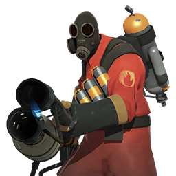
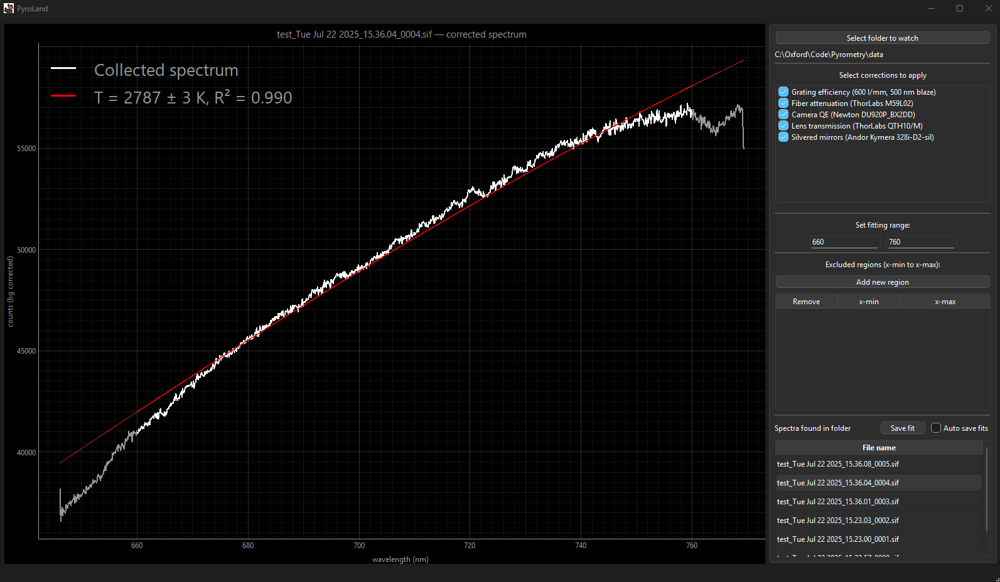

# Pyroland  :fire: Spectroscopy & Pyrometry GUI

[](https://github.com/jdolinschi/pyroland/releases/latest)
[](https://github.com/jdolinschi/pyroland/blob/main/LICENSE)


<div align="center">
  
</div>

**Pyroland** is a cross-platform desktop application that **watches an Andor Solis
acquisition folder in real time**, corrects each incoming `.sif` spectrum with
your instrument-specific calibrations, performs a pyrometric (grey-body) fit,
and plots the result instantly.

---

## Quick start (Windows)

| Option                      | Steps                                                                                                        | Requires Python? |
|-----------------------------|--------------------------------------------------------------------------------------------------------------|------------------|
| **1 · One-click EXE**       | 1. Download **Pyroland-1.0.0.exe** from the [Releases] page.<br>2. Double-click.                             | **No** |
| **2 · Poetry / developers** | `git clone https://github.com/jdolinschi/PyroLand`<br>`cd PyroLand`<br>`poetry install`<br>`poetry run pyroland` | **Yes** (3.11 – 3.13) |

> **Updating**  
> • EXE users: download the newer EXE from *Releases*.  
> • Poetry users: `git pull && poetry install --sync`.

---

## Setting up **Andor Solis** for live processing :telescope:

1. **Enable Auto-Save** in Solis  
   *Settings → Auto-Save → Enable*  
   and choose **“SIF (*.sif*)”** as the file format.
2. Pick (or create) an output folder, e.g.  
   `D:\Experiments\2025-07-Plasma`.
3. In Pyroland click **“Select folder to watch”** and point it to the same folder.  
   Pyroland now tracks the directory; every new `.sif` triggers an automatic load, correction, fit, and plot.

---

## Workflow in one GIF 🤖 *(screenshot placeholder)*

<div align="center">
  
</div>

---

## Feature highlights

| Category | What you get                                                                                                                                                                                                                                                              |
|----------|---------------------------------------------------------------------------------------------------------------------------------------------------------------------------------------------------------------------------------------------------------------------------|
| **Calibration pipeline** | Grating efficiency · Fiber attenuation · Camera QE · QTH-lamp lens transmission · Silvered-mirror reflectance – all switchable live.                                                                                                                                      |
| **Interactive pyqtgraph** | • Pan = *left-drag* or *middle-drag*<br>• Zoom (both axes) = *wheel*<br>• Zoom X / Y only = *right-drag* horizontally / vertically<br>• Reset view = *double-click left button*<br>• Full context menu on *right-click* (export, log-scale, grid …)                       |
| **Flexible fitting mask** | Global **x-min/x-max** fields *or* unlimited “excluded regions” rows. Each region is a pair of numbers; click **“✚ Add new region”** then enter x-min and x-max. Remove with the **“X”** button in that row.                                                              |
| **Auto-save fits** | Tick **“Auto save fits”** → choose a folder. Every time a new `.sif` is processed Pyroland writes `<filename>.asc` (wavelength, counts, fit) into that folder. Changes like calibration selections/unselections and fitting range changes overwrites the old `.asc` file. |
| **Manual save** | Click **Save fit** to write the currently displayed spectrum/fit anywhere you like.                                                                                                                                                                                       |
| **High-res export** | Right-click plot → “Export” for PNG, SVG, CSV, …                                                                                                                                                                                                                          |
| **Qt native UI** | Built with **PySide 6** · runs on Windows, macOS, Linux.                                                                                                                                                                                                                  |

---

## Detailed explanation 🗺️

### 1.  Selecting corrections
* The right-hand list starts with all five corrections **checked**.  
* Un-check any calibration you don’t want; the plot and fit refresh automatically.  
  *Double-click* a correction to open a pop-up window describing its origin (citation, measurement method, uncertainty, …).

### 2.  Global fitting range
* Fields **“x-min”** and **“x-max”** apply a single contiguous range for fitting.  
  Leave either blank to fit from the first/last data point.

### 3.  Excluded regions table
* Click **Add new region** to insert a row with two editable cells.  
  Enter **x-min** and **x-max** to *exclude* that slice from the fit.  
* Add as many regions as you like; Pyroland unions them into a final fit-mask.  
* Remove a region with the **“X”** button in its row.  
* Invalid ranges (x-min ≥ x-max) trigger an inline warning.

### 4.  Saving results
| Button / checkbox | What happens |
|-------------------|--------------|
| **Save fit** | Opens a file dialog and writes a single `.asc` file containing raw data, corrected counts, fit curve, temperature, and metadata. |
| **Auto save fits** | Prompts once for a folder, then silently writes an `.asc` alongside every processed `.sif`. Un-tick to stop. |

---

### A note on **grating-efficiency curves** :warning:

Our Kymera carries **three** gratings, yet Oxford Instruments ships an efficiency
curve for only **one** of them (600 l/mm, 500 nm blaze) – thanks, Oxford! 🙃  
If you need curves for *your* other gratings you’ll have to generate them
manually:

1. Visit <https://andor.oxinst.com/tools/resolution-calculator>.
2. Pick the **exact** grating and camera you use.
3. Slog through the web calculator entering one wavelength at a time (yes,
   really) and copy the efficiencies into a CSV. I generated a text file of all integers, comma separated, between 300 and 1500 (wavelength in nm) and copied and pasted it into their calculator.
4. Save that CSV in `src/pyroland/corrections/data/` following the same
   two-column format as the supplied `grating_600lm_500nmBlaze_efficiency.csv`.
5. Add a small corrector class (see existing examples) and you’re all set.

Maybe one day Oxford will bundle the full set of curves… but until then, this
is the workaround.

---

## Extending / contributing :hammer_and_wrench:

1. Fork → feature branch → PR.  
2. `poetry run pytest` must pass (CI runs Ruff and Black).  
3. Add new calibration curves by dropping a CSV into `src/pyroland/corrections/data/` and creating a small corrector class that subclasses `BaseCorrector` (see existing examples).

---

## License

Pyroland is released under the **MIT License** – see [`LICENSE`](LICENSE).  
If you use Pyroland in published work, please cite it!

```text
@software{dolinschi_pyroland_2025,
  author  = {Nathan Dolinschi},
  title   = {Pyroland: Spectroscopy & Pyrometry GUI},
  year    = {2025},
  version = {1.0.0},
  url     = {https://github.com/jdolinschi/pyroland}
}
